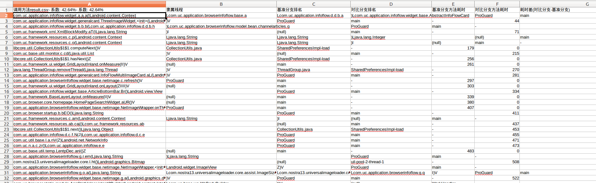

# TraceAnalysis
`traceview`分析工具（android）
- 该工具可以把对应`trace`的方法耗时/调用堆栈以及线程关系给解析出来
- 主要用于在两次版本迭代时，为了迅速找到新版本新增的方法以及异常的方法耗时，可以使用默认的`sheet_analysys.py`来生成报表

## 使用方式
### 前置操作
在`config.py`中配置基准`traceview`路径以及对比`traceview`路径，如果需要解混淆，配置对应`mapping`文件路径，目前已自带解`mapping`工具

### 结果输出
有两种方式
1. 通过`TraceUtils(...).anti_mapping.analysis.get("dict")`可以获取解析结果,结果是一个`dict/json`，格式为
```json
            {
                "inclusive": "xx",
                "exclusive": "xx",
                "method_thread": "xx",
                "theads_pid": "xx",
                "call_times": "xx",
                "costs": "xx",
                "sorted_dic": "xx"
            }

```
如图所示：


内部详细堆栈可以查看很多细节，例如调用堆栈


2. 使用默认的报表对比方法，该方法直接对比两个trace文件的方法，过滤出新增的方法，以及同一个方法的耗时差对比，入口为`sheet_analysis.py`，通过`render.py`来将结果渲染成csv文件

### 注意事项
1. `config.py`的`WATCH_MODULES`可以用来设置需要关注的模块，采用此配置可以在解析中过滤出我们不需要关心的包或者模块中的方法
2. `config.py`的`MAPPING_FILE`用于配置反混淆mapping(如果不配置，则不会反混淆)，默认采用`convertutil.jar`来生成混淆前的`trace`文件，如果修改`TraceHandler`中的`anti_mapping`函数

### 使用效果
由于现在组件化趋势比较明显，并不一定所有的模块都提供了`mapping`文件，因此，直接用混淆后的`trace`去做对比，不一定能达到理想的效果


