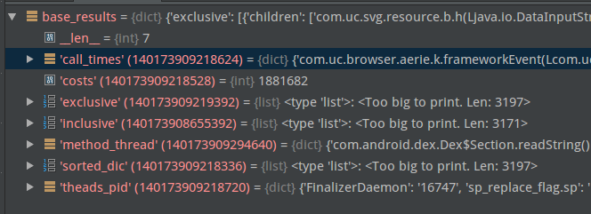
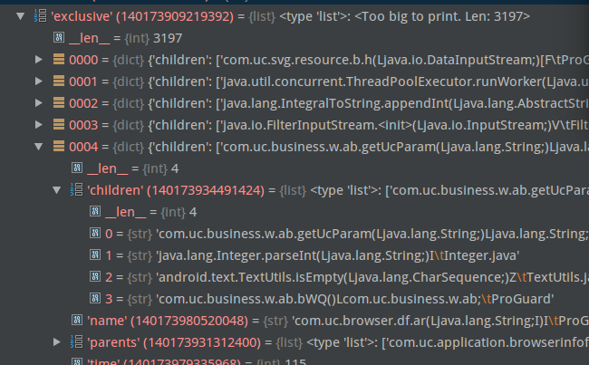

# TraceAnalysis
启动时间的traceview分析工具

## 使用方式
### 前置操作
在config.py中配置基准traceview路径以及对比traceview路径，如果需要解混淆，配置对应mapping文件路径，目前已自带解mapping工具

### 结果输出
有两种方式
1. 通过TraceUtils(...).anti_mapping().analysis()可以获取解析结果,结果是一个字典，格式为
```json
            {
                "inclusive": "xx",
                "exclusive": "xx",
                "method_thread": "xx",
                "theads_pid": "xx",
                "call_times": "xx",
                "costs": "xx",
                "sorted_dic": "xx"
            }

```
如图所示：

内部详细堆栈可以查看很多细节，例如调用堆栈


2. 直接执行sheet_analysis.py，这里提供了一种默认的使用方式，通过render.py来将结果渲染成csv文件